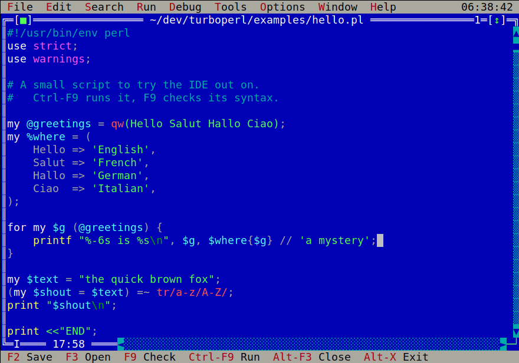

# TurboPerl

A Turbo Pascal style IDE for Perl, written in Free Pascal on top of Free
Vision — the text mode UI framework that ships with FPC as a clone of
Borland's Turbo Vision.

It is a full screen terminal application: menu bar across the top, status
line along the bottom, overlapping windows in between, and the muscle memory
of a 1992 Borland IDE pointed at a modern perl.



## What it does

- **Perl syntax highlighting** that understands the awkward parts of the
  language: POD blocks, `__END__`/`__DATA__`, here-documents (including
  `<<~`, `<<""`, and several queued on one line), every quote-like operator
  from `q` to `tr`, interpolation inside strings and regexes, and the
  difference between `$x / 2` and `split /,/`.
- **Run your script** (Ctrl-F9) with its output captured into a window, or
  on the real console when it needs the keyboard. `Alt-F5` steps back to the
  terminal afterwards, so a console run's output can be read again.
- **Syntax check** (F9) with `perl -c`. Errors land in a message list;
  Enter on one opens the file and puts the cursor on the line.
- **An integrated debugger** in the Turbo Pascal mould: breakpoints, step
  into/over/out, run to cursor, watches, a call stack and evaluate — with
  the current statement highlighted in the editor.
- **perldoc** for the word under the cursor (Ctrl-F1), or by name.
- **perltidy** and **perlcritic** if they are installed, plus `perl -MO=Deparse`.
- The usual editor: multiple windows, find and replace, undo, clipboard,
  block comment/indent, go to line.

## Building

Needs Free Pascal with the Free Vision units (`fp-units-fv` on Debian and
Ubuntu, `fpc-src`/`fpc` elsewhere) and a perl to point it at.

```sh
make            # builds ./turboperl
make test       # headless unit tests plus scripted interface tests
make corpus     # runs the highlighter over every Perl file it can find
sudo make install
```

`make install` puts the binary in `$(PREFIX)/bin` and the helper library in
`$(PREFIX)/share/turboperl/lib`; `PREFIX` defaults to `/usr/local`.

`make deb` builds `packages/turboperl_<version>_<arch>.deb`, which installs
under `/usr` instead.  Each release on GitHub has one attached: merging a pull
request that changes `TPVersion` in `src/tpconst.pas` tags the merge commit
`v<version>` and publishes the packages with it.

If Free Vision lives somewhere unusual, point the build at it:

```sh
make FVUNITS=/path/to/fpc/units/x86_64-linux/fv
```

## Running

```sh
turboperl                    # empty desktop
turboperl script.pl lib.pm   # open some files
turboperl --perl /opt/perl/bin/perl script.pl
turboperl --no-hilite big-generated-file.pl
turboperl --help
```

## Keys

| Key | |
|---|---|
| `F2` / `F3` | save / open |
| `F9` | syntax check (`perl -c`) |
| `Ctrl-F9` | run |
| `Ctrl-F1` | perldoc for the word under the cursor |
| `Alt-F7` / `Alt-F8` | previous / next message |
| `Alt-C` / `Alt-U` | comment / uncomment the selected lines |
| `Alt-I` / `Alt-D` | indent / unindent the selected lines |
| `Alt-O` / `Alt-M` | show the output / message window |
| `Alt-F5` | user screen — step back to the terminal a console run wrote to |
| `F5` / `F6` / `Alt-F3` | zoom / next window / close |
| `F10` | menu |
| `Alt-X` | exit |

Debugger:

| Key | |
|---|---|
| `F7` / `F8` | step into / step over |
| `F4` | run to cursor |
| `Ctrl-F9` | continue (the same key that runs, when something is stopped) |
| `Ctrl-F8` | toggle breakpoint |
| `Ctrl-F2` | program reset |
| `Ctrl-F4` | evaluate / modify |
| `Ctrl-F7` | add watch |
| `Ctrl-F3` | call stack |

Select with Shift and the cursor keys, or mark a block the WordStar way with
`Ctrl-K B`. Find, replace and go to line are on the Search menu with their
usual `Ctrl-Q` prefixes.

### Console runs

"Run on console" hands the terminal back to the script, so it can prompt and
read from the keyboard. The IDE waits on `press Enter` afterwards rather than
repainting over the output, and discards anything already sitting in the
input buffer first — a stray mouse report or a queued keystroke would
otherwise satisfy that prompt and take the output away before it could be
read. `Alt-F5` goes back to the terminal at any time.

Successive runs carry on below one another: the IDE lives on the terminal's
alternate screen, and stepping off it by hand — rather than through
`DoneVideo`, which homes the cursor afterwards — leaves the console exactly
where it was, scrollback and all. Terminals with no alternate screen (the
Linux console, plain vt100) share one screen with the IDE, so there the
console is cleared on the way out, as it has to be.

If the output still never appears, run with the default `capture` mode
instead: it collects stdout and stderr into the Output window, where they
stay until cleared. Setting `TURBOPERL_DEBUG` to a file name makes the IDE
write the terminal type and the screen-switch sequences it detected there,
which is the first thing to check when a console run misbehaves.

## The debugger

`F7` or `F8` on a saved file starts a session and stops before the first
statement, the way Turbo Pascal did from cold. From there the keys above
behave as you would expect; `Ctrl-F9` does double duty, continuing when
something is stopped and running normally otherwise.

The current statement is shown black on cyan across the whole line, and
breakpoint lines white on red. A breakpoint set on a line Perl cannot stop
on — a blank line, a comment, the middle of a statement — moves to the next
line that it can, and the marker moves with it, so what you see is where the
program will actually stop.

Watches, Variables and Call Stack share the strip at the bottom of the
screen. Variables lists the lexicals in scope at the stop, one line each
and cut short to fit; Right (or `+`, or Enter) opens an array, hash or
reference out a level to show its elements, Left (or `-`) closes it again,
and whatever is open stays open as you step. Watches are
re-evaluated every time the program stops, and Enter on a call stack frame
opens that file at that line. Everything the program prints goes to the
Output window as it happens, so you can watch it accumulate while stepping.

It is built on [Devel::ebug](https://metacpan.org/pod/Devel::ebug), driven
through a small bridge (`lib/TurboPerl/Debug/Bridge.pm`) that the IDE talks
to over a line of JSON at a time. The bridge exists for two reasons: the IDE
is not Perl, and every stop needs the location, stack, variables, watches
and new output together — six round trips gathered into one message.

Two things to know. The program's output is captured rather than given the
terminal, so a script that prompts for keyboard input cannot be stepped
through; run it normally for that. And `perl -d` is several times slower
than an ordinary run.

## Settings

Options / Save options writes `~/.turboperlrc`, a plain list of
`key = value` lines with comments, meant to be edited by hand as well:

```
perl           = /usr/bin/perl
args           = --verbose input.txt
runmode        = capture
unbuffer       = yes
timeout        = 60
tabsize        = 4
highlight      = yes
# scheme: 0 classic, 1 quiet, 2 custom
scheme         = 0
colour.keyword = 15
colour.string  = 10
```

Everything after `=` is the value, so a path may contain a `#`; comments
always sit on their own line.

Set `scheme = 2` to use the `colour.*` entries, which are IBM PC text
attribute numbers 0–15. Only the foreground is stored — the background comes
from the window's own palette, so highlighting still looks right if the
window colours change.

### Unbuffered output

When a script's output is a pipe, perl block-buffers `STDOUT` while leaving
`STDERR` unbuffered, so everything the script printed arrives after
everything it warned about. With `unbuffer = yes` the IDE loads the bundled
`TurboPerl::Unbuffer` through `PERL5OPT`, which turns on autoflush for both
handles and restores the original order. Turn it off if you would rather
perl saw an untouched environment.

## Layout

| | |
|---|---|
| `turboperl.pas` | command line, then hands over to the application |
| `src/tpconst.pas` | command codes, token kinds, colour schemes |
| `src/tphilite.pas` | the Perl scanner: one line in, a token per character out |
| `src/tptext.pas` | block comment/indent/strip and argument splitting, as pure functions |
| `src/tpperl.pas` | running perl, capturing output, parsing its diagnostics |
| `src/tpconfig.pas` | `~/.turboperlrc` |
| `src/tpedit.pas` | the editor view and its window |
| `src/tpviews.pas` | the output, message and debugger windows |
| `src/tpdebug.pas` | the debug session: talks to the bridge, holds breakpoints |
| `lib/TurboPerl/Debug/Bridge.pm` | the Perl half, driving Devel::ebug |
| `src/tpdlgs.pas` | settings dialogs |
| `src/tpapp.pas` | menus, status line, and everything wired together |

The pieces that can be tested without a screen are kept out of the view
objects on purpose — `tphilite`, `tptext`, `tpperl` and `tpconfig` have no UI
dependencies and are exercised directly by the programs in `tests/`.

## Tests

```
make test
```

- `tests/texttest` — block operations and argument splitting, including
  CRLF files and files with no final newline.
- `tests/cfgtest` — the settings file round trips, including a perl path
  containing a `#`.
- `tests/perltest` — running a child, feeding it stdin, timing out a runaway
  one, bulk output, a missing interpreter, and the diagnostic parser.
- `tests/dbgtest` — a whole debug session with no user interface: break,
  run, inspect lexicals, evaluate in the stopped frame, step out, collect
  output, run to the end.
- `tests/hltest` — a headless highlighter you can point at any file:
  `tests/hltest -m f.pl` prints a token map under each line, `-s` prints the
  scanner state after it, and with no flag it prints the file in colour.
- `run-tests.sh` — drives the real IDE inside tmux and reads the screen back:
  that the file loads and is coloured, that F9 finds an error and Enter jumps
  to it, that a run captures stdout and stderr in the right order, that block
  comment round trips, that a long line scrolls sideways correctly, and that
  perldoc works.

`make corpus` is the highlighter's main regression net. It scans every
`.pm`, `.pl` and `.t` file it can find and checks that none of them leaves
the scanner stuck inside a quote or a here-document — the failure mode that
would paint the rest of a file as one long string. It currently runs clean
over the 8,873 files in this machine's perl installation.

## Notes on the implementation

**Highlighting.** `TEditor.FormatLine` is virtual, so highlighting is a
matter of overriding it: read the line, run the scanner, and emit characters
with attributes. The cross-line context — POD, here-document queue, open
quotes — lives in a single record, which the editor caches so consecutive
lines of a redraw resume in constant time. Free Vision offers no hook that
fires when the buffer changes (`InsertBuffer` and `DeleteRange` are not
virtual), so the cache is dropped on every redraw and rebuilt from the top of
the buffer to the first visible line. That costs about a millisecond for a
100 KB file.

**Horizontal scrolling.** `TEditor.DrawLines` declares its draw buffer as an
array of `Sw_Word` but fills it with 16-bit character/attribute pairs, then
indexes it by `Delta.X`. Where `Sw_Word` is wider than `Word` — as on any
64-bit build — that index lands at the wrong byte and a horizontally scrolled
line comes out as rubbish. `FormatLine` here writes the visible columns at
the offset the caller will actually read from, which fixes the display
without patching the upstream unit.

**Shift-selection.** `TEditor` decides whether to extend a selection by
calling `Drivers.GetShiftState`, which asks the keyboard driver which shift
keys are held *right now* — something a terminal cannot answer, so it always
says no. The shift state of the keystroke itself does arrive, in
`Event.KeyShift`, so the editor here uses that to drive the `Selecting` flag.

**Perl is not quite lexable.** A highlighter that does not run the program
has to guess in a few places. The guesses are marked in `tphilite.pas` where
they are made; the notable one is that a slash after a keyword starts a match
rather than a division, which gets `split /,/` right at the cost of
`time / 60`.

## Licence

Public domain / CC0. Free Vision and Free Pascal are under their own
licences.
